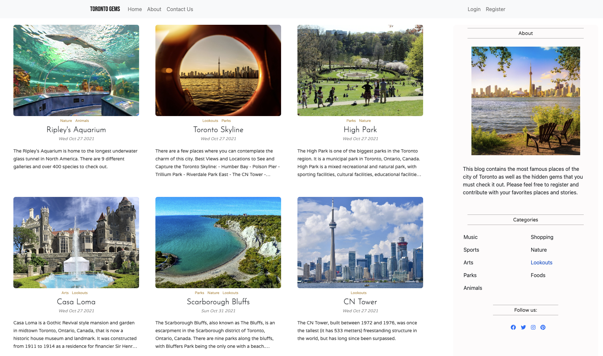
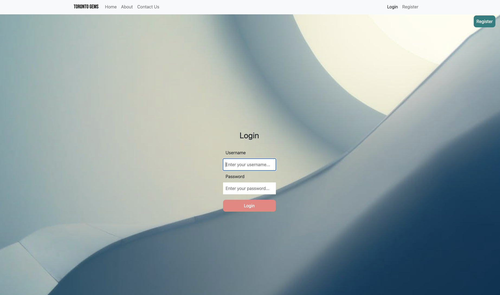
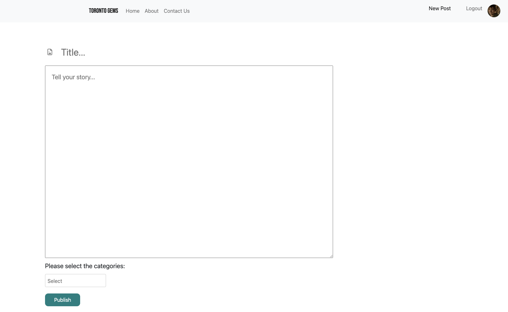

# Toronto Gems

A full stack blog that contains popular places to visit in Toronto with some interesting details. Besides the must go places this blog contains some underrated spots worth checking before they get too popular.

Tech stack: MongoDB, ExpressJs, ReactJs, NodeJs, Javascript, HTML and CSS.

[Please visit!](https://blog-toronto-app.onrender.com/#/)

## Description

In the project directory, you will find:

Tech stack:

- MongoDB/Mongoose
- ExpressJs
- ReactJs
- NodeJs
- Javascript, HTML, CSS
- REST API
- AWS

Link for the [API](https://github.com/hseiji/blog-toronto-api)

## Getting Started

### `npm install`

Install the npm packages

### `npm start`

Run the application on port 3000
